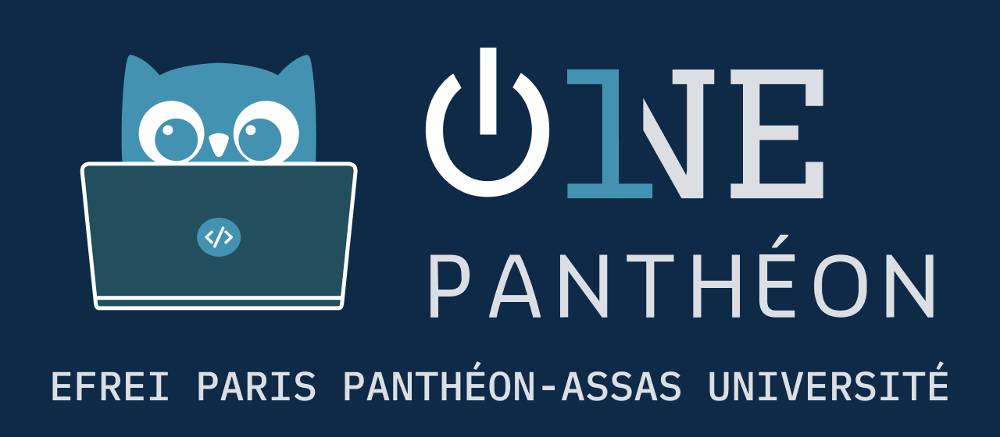

# Branding

Ce repository github stocke et archive l'identité visuelle de l'association One Panthéon.

Les images sont dans le domaine privé et il est interdit de les réutiliser, à l'exception d'une partie d'entre elles. Pour en savoir plus, se référer au fichier [LICENSE.md](LICENSE.md)

## Identité graphique depuis le 08/2023

Cette identité graphique a été conçue par Logan TANN pour One Panthéon. L'ensemble des images ont été modélisées manuellement sur Figma (les données d'éditions ne sont donc pas exportées).

### Logos

1. **Utilisation du Logo**:
   - Le logo principal de l'association est l'asset `Logo`. Il doit être utilisé de manière prépondérante dans toutes les communications officielles.
   - Il est fourni en version "Light" (pour un fond clair) et "Dark" (pour un fond sombre). Choisissez la version appropriée en fonction du fond sur lequel le logo sera affiché.
   - Le fichier [Logo_Light_Transparent.png](Branding2024_CC-BY/Logo_Light_Transparent.png) convient à la plupart des besoins.

2. **Logo sans chouette ni mention "Efrei Paris Panthéon-Assas université"**:
   - L'usage seul de l'asset `Logo Small` est toléré lorsque le logo original devient illisible en raison de sa taille réduite sur une surface. 

3. **Chouette sans la mention "One Panthéon"**:
   - Dans les communications, l'asset `Geek Owl` en tant que remplacement du logo de l'association est fortement déconseillé.
   - Toutefois, vous pouvez le mettre en évidence à des fins de rappel d'identité, par exemple, en l'affichant discrètement en haut à droite de chaque slide dans une présentation.

4. **Assets ayant la mention "privé"**:
   - Certains assets portent la mention "privé" car ils ont été créés pour des usages spécifiques et réservés à des fins internes ou restreintes.
   - Par conséquent, leur réutilisation et/ou modification ne doit pas être effectuée sans l'autorisation explicite de l'association.

Assurez-vous de respecter ces recommandations pour préserver l'identité de l'association dans toutes les communications publiques.

<table>
<thead>
<tr>
<th>Asset name</th>
<th>Preview</th>
<th>File (1/2)</th>
<th>File (2/2)</th>
<th>License</th>
</tr>
</thead>
<tbody>
<tr>
<td>Logo</td>
<td></td>
<td><b>Dark</b> Transparent (<a href="Branding2024_CC-BY/Logo_Dark_Transparent.png">png</a>) (<a href="Branding2024_CC-BY/Logo_Dark_Transparent.svg">svg</a>) Filled (<a href="Branding2024_CC-BY/Logo_Dark_Filled.png">png</a>)</td>
<td><b>Light</b> Transparent (<a href="Branding2024_CC-BY/Logo_Light_Transparent.png">png</a>) (<a href="Branding2024_CC-BY/Logo_Light_Transparent.svg">svg</a>) Filled (<a href="Branding2024_CC-BY/Logo_Light_Filled.png">png</a>)</td>
<td> Created by One Panthéon </td>
</tr>
<tr>
<td>Logo Small</td>
<td></td>
<td><b>Dark</b> Transparent (<a href="Branding2024_CC-BY/LogoSmall_Dark_Transparent.png">png</a>) (<a href="Branding2024_CC-BY/LogoSmall_Dark_Transparent.svg">svg</a>) Filled (<a href="Branding2024_CC-BY/LogoSmall_Dark_Filled.png">png</a>)</td>
<td><b>Light</b> Transparent (<a href="Branding2024_CC-BY/LogoSmall_Light_Transparent.png">png</a>) (<a href="Branding2024_CC-BY/LogoSmall_Light_Transparent.svg">svg</a>) Filled (<a href="Branding2024_CC-BY/LogoSmall_Light_Filled.png">png</a>)</td>
<td> Created by One Panthéon </td>
</tr>
<tr>
<td>Geek Owl</td>
<td> </td>
<td><b>Dark</b> Transparent (<a href="Branding2024_CC-BY/GeekOwl_Dark_Transparent.png">png</a>) (<a href="Branding2024_CC-BY/GeekOwl_Dark_Transparent.svg">svg</a>)</td>
<td><b>Light</b> Transparent (<a href="Branding2024_CC-BY/GeekOwl_Light_Transparent.png">png</a>) (<a href="Branding2024_CC-BY/GeekOwl_Light_Transparent.svg">svg</a>)</td>
<td> Created by One Panthéon </td>
</tr>
<tr>
<td>Social Icon</td>
<td> </td>
<td>Filled (<a href="Branding2024_Private/SocialOne_Dark_Filled.png">png</a>) (<a href="Branding2024_Private/SocialOne_Dark_Filled.svg">svg</a>)</td>
<td></td>
<td>Private  Do not reuse </td>
</tr>
<tr>
<td>Inline</td>
<td> </td>
<td>Filled (<a href="Branding2024_Private/Inline_Dark_Filled.png">png</a>) (<a href="Branding2024_Private/Inline_Dark_Filled.svg">svg</a>)</td>
<td></td>
<td>Private  Do not reuse </td>
</tr>
<tr>
<td>Cards</td>
<td> </td>
<td>One Panthéon Filled (<a href="Branding2024_Private/Card_One-Panthéon.png">png</a>) (<a href="Branding2024_Private/Card_One-Panthéon.svg">svg</a>) </td>
<td>One Panthéon x Efrei Craft Filled (<a href="Branding2024_Private/Card_Efrei-Craft.png">png</a>) (<a href="Branding2024_Private/Card_Efrei-Craft.svg">svg</a>) </td>
<td>Private  Do not reuse</td>
</tr>
</tbody>
</table>

### Couleurs et polices

